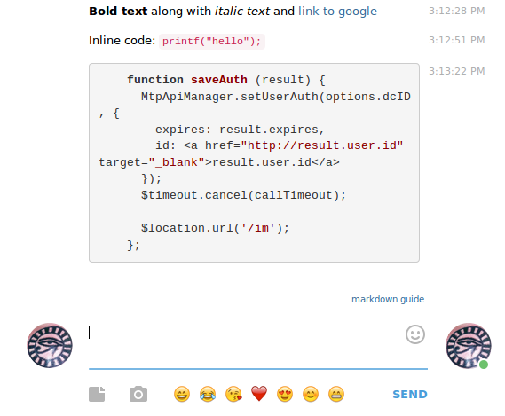

## [Hippopogram](http://i-hate-farms.github.io/hippopogram) a loving fork of webogram

[Hippopogram](http://i-hate-farms.github.io/hippopogram) adds features to our beloved [webogram](https://github.com/zhukov/webogram), the web application for [telegram](telegram.org)

For more information about webogram, read the [original documentation](README-ori.md)

## Added features
### [Support markdown](https://github.com/I-hate-farms/hippopogram/issues/2) syntax 
Using [marked](https://github.com/chjj/marked)




### [Replace old school western emoticons](https://github.com/I-hate-farms/hippopogram/issues/1) 
Replace text emoticons like :) with unicode modern ones :smile:


 

### Embed simple image links
if a link ending in `png`, `jpg`, `jpeg` or `webp` is posted, a preview is diplayed

 

## TODO
- [ ] enable [sent message editing](https://github.com/I-hate-farms/hippopogram/issues/3)

## How to run 

``` 
git clone https://github.com/I-hate-farms/hippopogram.git
cd hippopogram
npm install 
make package
make build
node server.js

```

open http://localhost:8000/app/index.html

## How to run 
To code with livereload and watched files, run 
```
make dev
```

## How to publish 
Run 
```
make local_publish
```
and push the file in `dist/` into to the `gh-pages` branch. 
## [Changelog](CHANGELOG.md)
